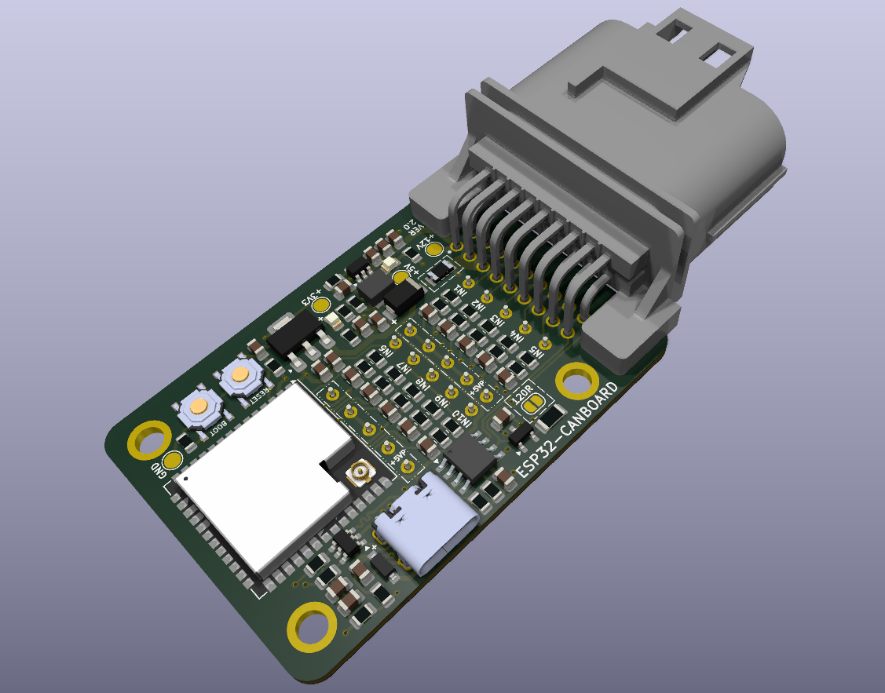
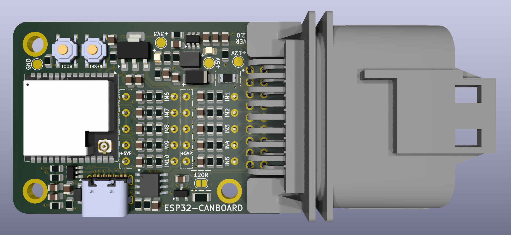
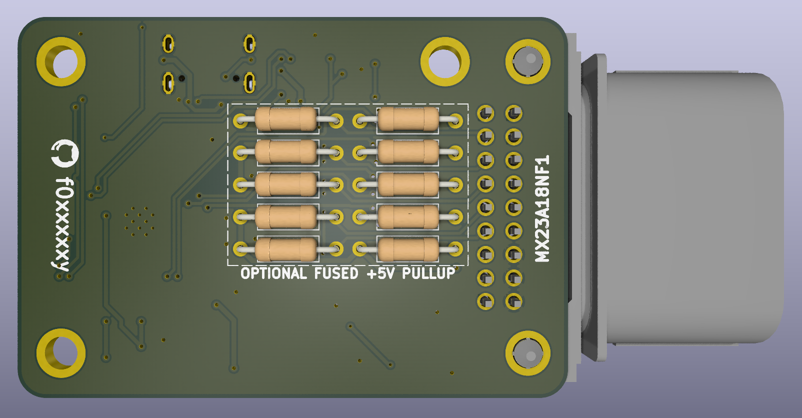

# ESP32-CANBoard
* ESP32-S3 Dual Core SoC
* MCP2562T CAN Transceiver (up to 1Mbps)
* 10x 5v Tolerant Inputs - Pressure Sensors, NTCs, etc
* 2x 5v Outputs - Fused at 500mA (Thermal Reset)
* USB-C for programming, with JTAG support for debugging
* ESD Protection on both USB and CAN
* JAE Automotive Connector (PCB Socket: MX23A18NF1, Cable Plug: MX23A18SF1)
* Optional pull-up resistors via fused 5v rail for each input (TH 6.3mm)
* Optional 120ohm CAN terminating resistor
* Small PCB Footprint - 40mm x 60mm

## Schematic
[View PDF](docs/esp32-canboard-schematic.pdf)

## Images

## Pinout
|Pin|Function|Additional Information|
|---|---|---|
|1|12v Power Input||
|2|5v Sensor Supply|500ma Thermal Fuse|
|3|5v Sensor Supply|500ma Thermal Fuse|
|4|Input 6||
|5|Input 7||
|6|Input 8||
|7|Input 9||
|7|Input 10||
|9|CAN High||
|10|Ground||
|11|Ground||
|12|Ground||
|13|Input 1||
|14|Input 2||
|15|Input 3||
|16|Input 4||
|17|Input 5||
|18|CAN Low||