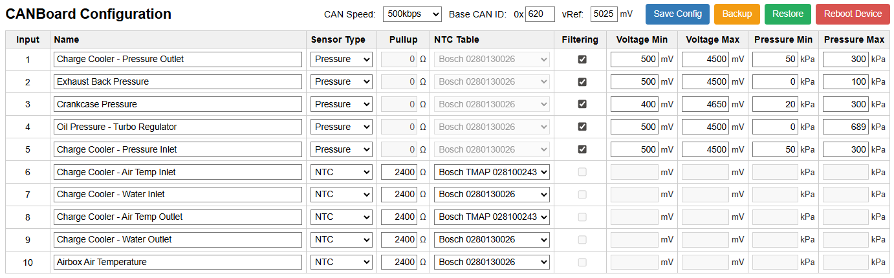
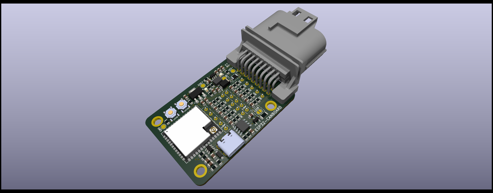
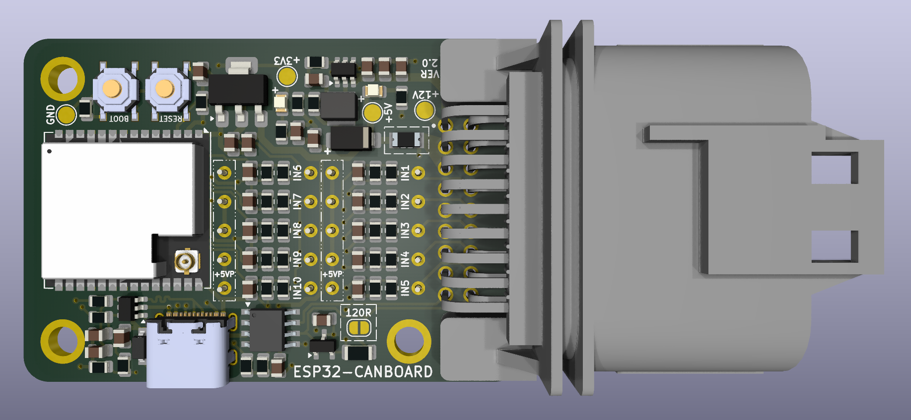
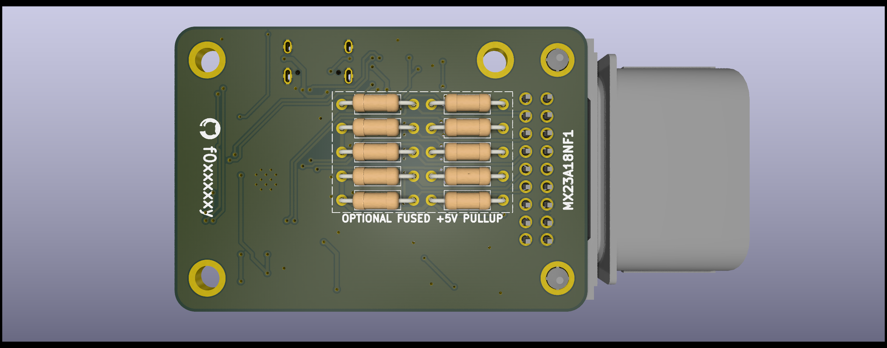

# ESP32-CANBoard
* ESP32-S3 Dual Core SoC
* MCP2562T CAN Transceiver (up to 1Mbps)
* 10x 5v Tolerant Inputs - Pressure Sensors, NTCs, etc
* 2x 5v Outputs - Fused at 500mA (Thermal Reset)
* USB-C for programming, with JTAG support for debugging
* ESD Protection on both USB and CAN
* JAE Automotive Connector (PCB Socket: MX23A18NF1, Cable Plug: MX23A18SF1)
* Optional pull-up resistors via fused 5v rail for each input (TH 6.3mm)
* Optional 120ohm CAN terminating resistor
* Configuration via web interface over WiFi
* Optional per-channel median filtering to reduce noise
* Small PCB Footprint - 40mm x 60mm

## Device Configuration

On each boot the board enables a WiFi access point and web configuration interface; this will automatically disable after 120 seconds if no client connects. 

| SSID | WPA2 Key | Web UI |
|:---|:---|:---|
| ESP32-CanBoard | canboard123 | http://192.168.4.1 |

The web UI allows you to:

- View and edit per-channel settings (name, sensor type, pull-up, filtering, pressure calibration).
- Configure required CAN parameters - Base ID and bus speed.
- Adjust pullup vref calculation voltage to allow for LDO regulator output/load.
- Backup the entire configuration to a JSON file.
- Restore configuration from a previously exported JSON file.

| Function | Description |
|:----|:----|
| Save Config | Save current UI settings to device storage (`/spiffs/config.bin`). Changes are validated and persisted immediately, reboot to apply. |
| Backup | Download a JSON snapshot of the current configuration. The filename is prefixed with `esp32-canboard-config-` and suffixed with the client timestamp in `ddmmyy-hhmmss` format. |
| Restore | Select a previously exported JSON file. The UI will upload the JSON to the device and validate the payload. The existing configuration is backed up on the device before overwrite; if saving the imported file fails, the device will restore the previous configuration. |
| Reboot Device | Reboots the device to apply configuration changes. |

**Notes:**
- Configuration is persisted on SPIFFS at `/spiffs/config.bin` (binary) and the web UI uses JSON export/import for human-readable backups.
- After restoring a new configuration via the web UI you should reboot the device to apply changes.

## CAN Output

The device transmits input data as a set of five CAN frames starting at the configured base ID. All frames use DLC=8 and little-endian byte ordering.

| CAN ID | Name | Payload |
|:---|:---|:---|
| Base ID | analogVoltage_1 | Inputs 0..3 as four uint16 (LSB,MSB) — bytes 0..7 (values in mV) |
| Base ID + 1 | analogVoltage_2 | Inputs 4..7 as four uint16 (LSB,MSB) — bytes 0..7 (values in mV) |
| Base ID + 2 | analogVoltage_3 | Inputs 8..9 as two uint16 (bytes 0..3), dynamic0 (bytes 4..5), dynamic1 (bytes 6..7) |
| Base ID + 3 | dynamicSignals_1 | dynamic2, dynamic3, dynamic4, dynamic5 as four 2-byte values (bytes 0..7) |
| Base ID + 4 | dynamicSignals_2 | dynamic6, dynamic7, dynamic8, dynamic9 as four 2-byte values (bytes 0..7) |

Encoding rules for dynamic values (one per input):
| Channel | Type | Encoding |
|:---|:---|:---|
|analogVoltage|-|unsigned uint16 = voltage * 1000 (resolution 0.001 V)|
|dynamicSignal|Raw|unsigned uint16 = **0** use analogVoltage signal instead|
|dynamicSignal|Pressure|unsigned uint16 = pressure_kPa * 100 (resolution 0.01 kPa)|
|dynamicSignal|NTC|signed int16 = temperature_C * 1 (°C as integer)|

## Schematic
[View PDF](docs/esp32-canboard-schematic.pdf)

## Images

## Connector Pinout
|Pin|Function|Additional Information|
|:---:|:---|:---|
|1|12v Supply||
|2|5v Sensor Supply|500ma Thermal Fuse|
|3|5v Sensor Supply|500ma Thermal Fuse|
|4|Input 6||
|5|Input 7||
|6|Input 8||
|7|Input 9||
|7|Input 10||
|9|CAN High||
|10|Ground||
|11|Ground||
|12|Ground||
|13|Input 1||
|14|Input 2||
|15|Input 3||
|16|Input 4||
|17|Input 5||
|18|CAN Low||