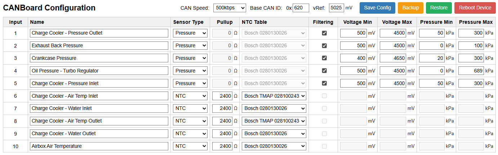
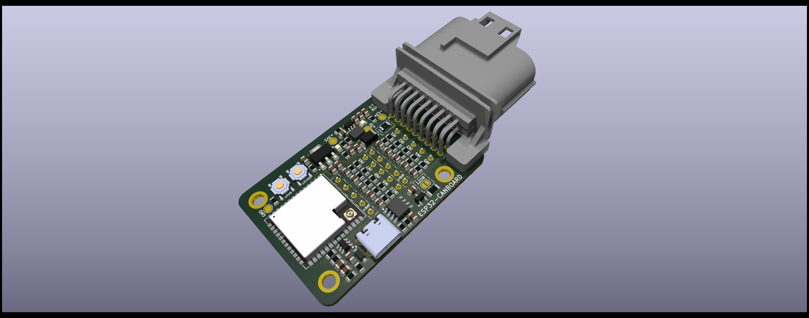
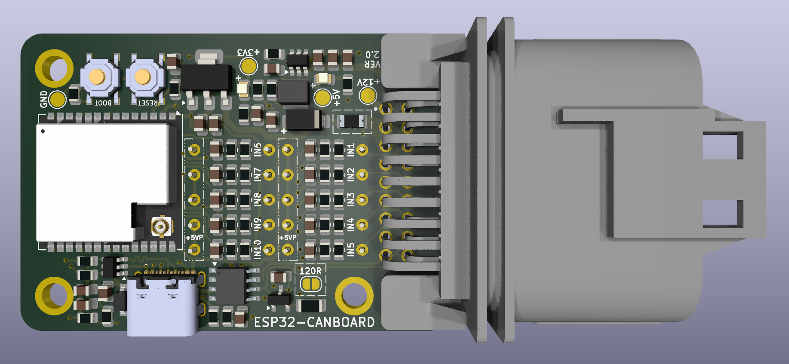
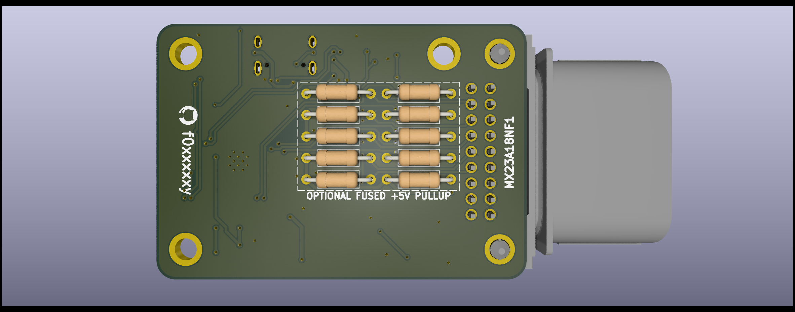

# ESP32-CANBoard
* ESP32-S3 Dual Core SoC
* MCP2562T CAN Transceiver (up to 1Mbps)
* 10x 5v Tolerant Inputs - Pressure Sensors, NTCs, etc
* 2x 5v Outputs - Fused at 500mA (Thermal Reset)
* USB-C for programming, with JTAG support for debugging
* ESD Protection on both USB and CAN
* JAE Automotive Connector (PCB Socket: MX23A18NF1, Cable Plug: MX23A18SF1)
* Optional pull-up resistors via fused 5v rail for each input (TH 6.3mm)
* Optional 120ohm CAN terminating resistor
* Configuration via web interface over WiFi
* Optional per-channel median filtering with selectable strength (none/low/med/high) to reduce noise
* Small PCB Footprint - 40mm x 60mm

## Build requirement

This project targets ESP-IDF 6.0.2. Activate the 6.0.2 environment before running any `idf.py` command; `main/idf_component.yml` and `dependencies.lock` enforce that toolchain version.

## Device Configuration

The board keeps its WiFi access point available continuously. To reduce idle memory use, the web server starts when a client associates with the access point and stops when that client disconnects.

Copy `main/inc/secrets.example.h` to the ignored `main/inc/secrets.h` and define infrastructure credentials with `KNOWN_WIFI_NETWORKS(X)`. Networks are tried in list order when ESP-NOW is disabled; the configuration access point remains available throughout.

| SSID | WPA2 Key | Web UI |
|:---|:---|:---|
| ESP32-CanBoard | canconfig | http://192.168.4.1 |

The web UI allows you to:

- View and edit per-channel settings (name, sensor type, pull-up, **filter level** dropdown, pressure calibration).
- Configure required CAN parameters - Base ID and bus speed.
- Configure CAN and ESP-NOW output, including optional CAN bus relay over ESP-NOW.
- Define reusable global Conditions from local sensor values or DBC-imported CAN signals, then reference those booleans from multiple Outputs and Triggered timers.
- Configure up to 8 Outputs using local sensor values, DBC-imported CAN signals, Conditions, startup timers, inline edge-triggered timers, PULSE lookup tables, and PWM duty lookup tables.
- Adjust pullup vref calculation voltage to allow for LDO regulator output/load.
- View current input voltages and calculated values in real time.
- Backup the entire configuration to a JSON file.
- Restore configuration from a previously exported JSON file.



| Function | Description |
|:----|:----|
| Save Config | Save current UI settings to the dedicated `config` NVS partition. Changes are validated, persisted and applied immediately. |
| Backup | Download one JSON snapshot containing the board configuration, reusable Conditions and Outputs. The filename is prefixed with `esp32-canboard-config-` and suffixed with the client timestamp in `ddmmyy-hhmmss` format. |
| Restore | Select a previously exported JSON file. The backend validates and applies the board configuration, Conditions and Outputs together while retaining their separate flash records. Legacy `rules` data is never imported. |
| Reboot Device | Reboots the device. |

**Notes:**
- Board configuration is persisted as one current record in the dedicated `config` NVS partition. Conditions and Outputs are persisted together in the existing CRC-checked raw `rules` partition with atomic A/B writes; the partition location is unchanged even though the user-facing feature is now named Outputs.
- Only the current version-15 NVS board record is accepted. Pre-v15 NVS records and `/spiffs/config.bin` are deliberately unsupported after the verified 2026-10-05 aggregate backup.
- Normal `idf.py flash` updates the application and SPIFFS web assets, but does not write the dedicated `config` partition.
- `erase-flash`, whole-chip images, or explicitly flashing address `0x200000` will still erase configuration; ordinary application/partition-table flashing will not.
- After restoring a new configuration via the web UI the changes are applied immediately.
- The current checked-in recovery export is `config/esp32-canboard-config-051026-090441.json` (SHA-256 `25cc3a9ffa824093bf31c163345749b8048a588224715e386e33c09e3a9b6c78`). It contains all ten channels, two ESP-NOW clients, current GPS-source fields, Output schema version 4, one Condition, and three configured Outputs.

## Wi-Fi OTA

The VS Code custom task runs `scripts/build_and_ota.sh`. The script first checks
`/api/status`, rebuilds only when the existing `build/esp32-logger.bin` is
missing or stale, regenerates the embedded web asset as part of that build, and
then uploads the application to `/api/ota`. Connect to the `ESP32-CanBoard`
access point before using the default URL.

Set `ESP32_CANBOARD_OTA_URL` to override the target, for example:

```sh
ESP32_CANBOARD_OTA_URL=http://192.168.4.1/api/ota scripts/build_and_ota.sh
```

OTA requires the dual-slot partition table. After this change, perform one
normal UART `idf.py flash` to install the updated partition table and OTA-aware
firmware. Subsequent application updates can use the custom task. The existing
SPIFFS, `config`, and `rules` partition offsets are unchanged, so that initial
normal flash preserves stored configuration and Outputs; erasing the flash or
writing those data offsets explicitly does not.


## CAN Output

The device transmits five input-data frames followed by two Output command frames starting at the configured base ID. All frames use standard 11-bit CAN identifiers and DLC 8. Because the two Output frames occupy `Base ID + 5` and `Base ID + 6`, the configurable CAN base ID is restricted to `0x000` through `0x7F9`.

| CAN ID | Name | Payload |
|:---|:---|:---|
| Base ID | analogVoltage_1 | Inputs 0..3 as four uint16 (LSB,MSB) — bytes 0..7 (values in mV) |
| Base ID + 1 | analogVoltage_2 | Inputs 4..7 as four uint16 (LSB,MSB) — bytes 0..7 (values in mV) |
| Base ID + 2 | analogVoltage_3 | Inputs 8..9 as two uint16 (bytes 0..3), dynamic0 (bytes 4..5), dynamic1 (bytes 6..7) |
| Base ID + 3 | dynamicSignals_1 | dynamic2, dynamic3, dynamic4, dynamic5 as four 2-byte values (bytes 0..7) |
| Base ID + 4 | dynamicSignals_2 | dynamic6, dynamic7, dynamic8, dynamic9 as four 2-byte values (bytes 0..7) |
| Base ID + 5 | OutputBinaryCommands | Eight state bits, eight validity bits, eight pulse-mode bits, rolling counter, protocol version 2 |
| Base ID + 6 | OutputDutyCommands | Eight packed 7-bit duty percentages and the matching rolling counter |

The two Output frames are generated from one engine evaluation and one rolling counter. They are emitted in the order `Base + 5`, then `Base + 6`, after the five sensor frames at the configured 25 Hz or 50 Hz rate. When physical CAN is enabled both frames are sent to CAN, and both are also sent to every ESP-NOW client. The two Output CAN IDs are reserved: externally received frames colliding with either ID are not accepted as Output source data and are not re-relayed.

Encoding rules for dynamic values (one per input):

| Channel | Type | Encoding |
|:---|:---|:---|
|analogVoltage|-|unsigned uint16 = voltage * 1000 (resolution 0.001 V)|
|dynamicSignal|Raw|unsigned uint16 = **0** use analogVoltage signal instead|
|dynamicSignal|Pressure|unsigned uint16 = pressure_kPa * 100 (resolution 0.01 kPa)|
|dynamicSignal|NTC|signed int16 = temperature_C * 1 (°C as integer)|

Example DBCs for signal names and scaling are [dbc/esp32-canboard.dbc](dbc/esp32-canboard.dbc) and [dbc/esp32-canboard-outputs.dbc](dbc/esp32-canboard-outputs.dbc). The web UI also generates an Output DBC using the current base ID and configured Output labels.

### Outputs

There are eight configurable Outputs. Ordered cases retain the existing first-match `IF` / `ELSE IF` behavior; tests within one case are ANDed, while additional cases provide OR-through-ELSE-IF behavior. The tests only select which case runs: a matching PULSE case still derives its ON/OFF phase from the pulse lookup, and a matching PWM case still derives duty from the PWM lookup (with binary `state=1` only at exactly 100% duty). Existing OFF, ON, and PULSE actions retain their binary behavior. PWM is a fourth action and has its own numeric duty value; it does not replace or reinterpret the binary state, valid, or pulse signals.

For each timed PULSE lookup row, the cycle period must be greater than zero and the ON time must be between zero and the cycle period inclusive. `ON time = 0` means continuously OFF for that lookup point. The web editor exposes a dedicated `Permanently ON at/above` threshold instead of requiring a magic-looking final `ON time = cycle period` row. When configured, the UI stores that threshold as the final 1 s ON / 1 s period point in the existing PULSE lookup format, so no protocol or configuration-version change is required. Values at and above that threshold remain continuously ON.

Each PWM case selects one lookup source, a source hysteresis, and one through eight `{input_value, duty_percent}` rows. Input values must be finite and strictly increasing, and duties must be integer percentages from 0 through 100. Values below or above the lookup range clamp to the nearest endpoint. Values between rows are linearly interpolated and rounded to the nearest percentage. Duty is calculated immediately when a PWM case is entered, then held until the source differs from the accepted lookup input by **more than** the configured hysteresis. Entering another case, replacing configuration, startup, or source invalidation resets that PWM runtime state.

Source freshness and zero-confirmation rules apply equally to tests, PULSE lookup sources, and PWM lookup sources. A missing, stale, or not-yet-confirmed PWM source publishes `valid=0`, `state=0`, `pulse=0`, and duty `0`.

### Conditions

Up to 16 reusable named **Conditions** can be defined once and referenced by any Output case or Triggered timer. A Condition has one local-sensor or DBC-imported CAN source, a comparison and threshold, optional hysteresis, and a boolean result. Runtime state keeps `value` and `valid` separate: a Condition can therefore be `true`, `false`, or invalid. This avoids repeating CAN message/signal/comparison settings across multiple Outputs and reduces the chance of small configuration differences between rules.

Each Condition also defines what to do when its source later becomes unavailable or stale: `Invalid`, `False`, `True`, or `Hold last`. The stale policy is deliberately ignored until the Condition has first been established from at least one valid source sample. For example, `Engine running = DME1.RPM >= 600` with `When source stale = False` behaves as follows:

```text
Boot with no RPM ever received  -> Engine running is invalid
RPM received at 1000            -> Engine running = true
RPM CAN then disappears         -> Engine running = false
```

That distinction means ECU silence after a known-running engine can be used as a shutdown event without treating a board boot where the ECU was never present as an engine shutdown. A normal Output Condition test chooses whether the named Condition must be `True` or `False`; an invalid Condition retains the existing ordered-case unknown/invalid behavior rather than silently becoming false.

#### `Base ID + 5`: binary Output frame

Protocol version 2 keeps binary state, validity, and pulse mode independent. Only the low byte of each former 16-bit mask is used; the upper byte is required to be zero.

| Bytes | Encoding | Meaning |
|:---|:---|:---|
| 0 | uint8 bitmask | Output 1..8 state bits |
| 1 | uint8 | Reserved, must be `0` |
| 2 | uint8 bitmask | Output 1..8 validity bits |
| 3 | uint8 | Reserved, must be `0` |
| 4 | uint8 bitmask | Output 1..8 PULSE-mode bits |
| 5 | uint8 | Reserved, must be `0` |
| 6 | uint8 | Rolling counter, wraps `255 -> 0` |
| 7 | uint8 | Protocol version, exactly `2` |

For one Output, the action semantics are:

| Action / condition | state | valid | pulse | duty |
|:---|:---:|:---:|:---:|:---:|
| OFF | 0 | 1 | 0 | 0 |
| ON | 1 | 1 | 0 | 0 |
| PULSE, currently OFF | 0 | 1 | 1 | 0 |
| PULSE, currently ON | 1 | 1 | 1 | 0 |
| PWM, duty 0..99% | 0 | 1 | 0 | 0..99 |
| PWM, duty exactly 100% | 1 | 1 | 0 | 100 |
| Invalid / stale | 0 | 0 | 0 | 0 |

For OFF/ON/PULSE consumers, the safe applied binary state remains:

```text
applied binary state = valid AND state
```

For PWM, `state` is **not** a PWM-enabled flag. It is `1` only when the calculated duty is exactly 100%; duty 0 through 99 publishes `state=0`. Downstream configuration determines whether an Output should consume the duty field.

Examples for an otherwise empty binary frame (`CC` is the shared rolling counter):

| Situation | state / valid / pulse | `Base + 5` data bytes |
|:---|:---|:---|
| Output 1 continuously ON | `1 / 1 / 0` | `01 00 01 00 00 00 CC 02` |
| Output 1 validly OFF | `0 / 1 / 0` | `00 00 01 00 00 00 CC 02` |
| Output 2 in PULSE ON phase | `1 / 1 / 1` | `02 00 02 00 02 00 CC 02` |
| Output 2 in PULSE OFF phase | `0 / 1 / 1` | `00 00 02 00 02 00 CC 02` |
| Output 1 PWM at 50% | `0 / 1 / 0` | `00 00 01 00 00 00 CC 02` |
| Output 1 PWM at 100% | `1 / 1 / 0` | `01 00 01 00 00 00 CC 02` |
| Output invalid | `0 / 0 / 0` | `00 00 00 00 00 00 CC 02` |

#### `Base ID + 6`: duty frame

The duty frame packs eight unsigned 7-bit fields into bits 0 through 55. Values 101 through 127 are malformed and must be rejected by a consumer.

| Output | Start bit | Length | Valid values |
|:---:|:---:|:---:|:---:|
| 1 | 0 | 7 | 0..100 |
| 2 | 7 | 7 | 0..100 |
| 3 | 14 | 7 | 0..100 |
| 4 | 21 | 7 | 0..100 |
| 5 | 28 | 7 | 0..100 |
| 6 | 35 | 7 | 0..100 |
| 7 | 42 | 7 | 0..100 |
| 8 | 49 | 7 | 0..100 |
| Counter | 56 | 8 | 0..255 |

OFF, ON, and PULSE actions always publish duty `0`. Only the selected PWM action publishes a 0..100 value, and invalid PWM Outputs publish `0`. For example, Output 1 at 50% produces `32 00 00 00 00 00 00 CC`; Output 1 at 100% produces `64 00 00 00 00 00 00 CC`. A cross-byte example with duties `{0, 1, 99, 100, 1, 99, 100, 0}` produces `80 C0 98 1C 18 93 01 CC`.

A PWM consumer must treat `Base + 5` and `Base + 6` as one paired command. Accept duty only when both frames are correctly formed, both are fresh according to the consumer's timeout policy, and both counters match. A malformed frame, protocol-version error, duty outside 0..100, counter mismatch, or stale/missing partner must force applied duty to zero. Counter wrap from `255` to `0` is normal.

### Output timers

`Startup timer` is the original milliseconds-since-boot test. `Triggered timer` is an inline Output test and can be driven either directly from a local/CAN source or from a reusable Condition.

For a raw local/CAN trigger, the timer uses the configured comparison, threshold and optional hysteresis. It first has to observe that trigger false, which arms it; the next false-to-true transition starts the configured active period. Once active, the timer remains true until the period expires even if the raw trigger CAN source subsequently becomes stale or disappears.

For a Condition trigger, the editor selects a named Condition and whether the timer should trigger when it becomes `True` or `False`. The timer again arms only after first observing the opposite valid state. This combines with the Condition stale policy to handle ECUs that stop broadcasting before sending a low shutdown RPM. For example:

```text
Condition: Engine running
  DME1.RPM >= 600
  When source stale: False

Triggered timer:
  Engine running becomes False
  Active for 300 seconds
```

If the engine was observed running and its RPM broadcast then disappears, `Engine running` becomes false and the 300-second timer starts. If the board has never received a valid RPM sample, the Condition remains invalid and the timer does not arm or trigger.

Other AND tests remain live while a timer is active, so `OilTemp > 100 AND [Engine running becomes false, active for 300 s] -> ON` turns off early if oil temperature falls below the threshold, while the 300-second timer itself continues counting. Triggered timers are updated for every enabled Output before ordered case selection, so a timer in a lower-priority ELSE-IF case can still start while an earlier case is currently winning.

### Output configuration compatibility

The aggregate JSON property remains `outputs` at configuration version `4`. The current version-4 schema contains `signal_timeout_ms`, used CAN `sources`, a sparse `conditions` array numbered 1 through 16, and a sparse `outputs` array numbered 1 through 8. Conditions serialize `label`, `source_name`, comparison/hysteresis fields, and `stale_behavior`. Output Condition tests reference the Condition by name; Condition-driven Triggered timers serialize `trigger_condition_name`, the expected boolean state, and `trigger_duration_ms`. Raw-source Triggered timers retain their direct `source_name`, comparison/hysteresis and duration fields. PWM cases continue to serialize `pwm_source_name`, `pwm_hysteresis`, and `pwm_points`.

This change deliberately **does not introduce a configuration version 5**. Version 4 was amended to include Conditions, and there is no migration layer for older JSON Output configurations that predate the `conditions` array. New configuration GET/backup data always includes `conditions`, even when it is empty. The compact raw-partition format also remains version `4`; its previously reserved count field now records the number of persisted Conditions, which are stored in the same CRC-checked A/B record as Outputs and CAN sources. No partition-table change is required.

Pre-Output rule records remain deliberately incompatible and are not translated: on first boot with one of those old records, firmware initializes eight empty Outputs and no Conditions and commits the empty current record into both CRC-checked A/B slots. The physical raw partition remains named `rules` and remains at the same partition-table location.

Aggregate restore requires a valid current `outputs` object. Missing, malformed, or incompatible Output data and invalid CAN base IDs are rejected rather than reset, clamped, guessed, or translated. Legacy top-level `rules` backups are unsupported.

Live status is exposed as `/api/live_values.conditions` for configured Conditions and `/api/live_values.outputs` for configured Outputs. Condition status includes boolean value, validity, whether a valid source has ever established the Condition, source freshness and source-invalid reason. Output live status still includes `duty_percent` for the selected valid PWM case.

### E46 M3 MK60 cluster emulator (capture-first)

The firmware contains an opt-in MK60 request/response service for cars where
the original instrument cluster has been removed. It is disabled by default
and has no factory response payload: capture the car first with the standalone
listen-only logger in [`tools/mk60-can-capture`](tools/mk60-can-capture).

The `mk60_emulator` object is included in configuration backup/import JSON. A
profile contains the exact standard data frames observed after the MK60's
standard `0x610` RTR request. Only `0x610`, `0x613`, `0x615`, `0x316`, and
`0x329` are accepted, the first response must be `0x610`, and emulation can
only be enabled with a complete profile at 500 kbit/s.

```json
"mk60_emulator": {
  "enabled": false,
  "trigger_id": 1552,
  "trigger_dlc": 8,
  "responses": []
}
```

Populate `responses` from repeatable connected/disconnected captures. Each
entry has `id`, `dlc`, `delay_before_ms`, and an eight-element `data` byte
array. Do not copy example payloads from the internet or enable the feature
until the bytes and timing have been verified on the target MK60. A CAN
transmit error or bus-off condition latches the emulator off until its profile
is reapplied or the board restarts.

### CAN relay over ESP-NOW

When ESP-NOW and **Relay CAN bus** are enabled for a client, externally received CAN frames are encoded into the same portable raw-CAN batch protocol as the board's own frames. The wire format is not an in-memory `twai_message_t`: version 1 uses a 14-byte little-endian header followed by one to eighteen fixed 13-byte CAN records, for a maximum packet size of 248 bytes. Physical CAN transmission of the board's own sensor frames may remain disabled; the TWAI controller and CAN speed setting remain active while relay reception, MK60 emulation, or externally sourced Output rules need CAN input.

Relay traffic is best-effort and lower priority than the board's sensor and GPS output. The bounded 128-frame queue discards its oldest frame when full instead of blocking ADC sampling or locally generated transmissions. Frames are batched for up to 5 ms. Each client has its own sequence and delivery state; after three consecutive delivery failures only that client backs off to one probe per second, while healthy clients continue at normal rate.

Each configured ESP-NOW client can also have an optional human-readable label. The label is persisted with the board configuration and included in configuration export/import JSON alongside that client's MAC address and relay setting. Existing configurations migrate with blank client labels.

ESP-NOW and the local configuration access point use Wi-Fi channel 1. The receiving ESP-NOW device must also operate on channel 1 and must give this board its station MAC as the permitted sender. Configure the receiver's station MAC as a client here; enable **Relay CAN bus** for that client only when physical CAN frames received by this board must also reach it. Locally generated sensor, Output, and GPS frames are sent to every configured client. ESP-NOW is unencrypted, so receiver MAC filtering rejects unrelated senders but is not cryptographic authentication.

While ESP-NOW is enabled, this firmware deliberately keeps the station radio on channel 1 and does not join a configured infrastructure network. The configuration SoftAP remains available and owns the fixed radio channel.

### Connected repository contract

| Repository | Role | ESP-NOW/CAN requirement |
|:---|:---|:---|
| `esp32-r8` | R8 dashboard/logger | Add its reported station MAC as a client; it defaults to permitting canboard STA MAC `DC:DA:0C:3B:B2:0C`. It decodes classic standard, non-RTR data frames only. |
| `esp32-e36` | E36 dashboard/logger | Add its reported station MAC as a client; it defaults to permitting canboard STA MAC `DC:DA:0C:3C:E8:08`. It decodes classic standard, non-RTR data frames only. |
| `esp32-output` | Output/PWM receiver and optional GPS responder | Add its displayed station MAC as a client. Output command frames use `Base + 5` and `Base + 6`; GPS response uses the separate 44-byte `GP` version-1 snapshot. |

The raw-CAN batch format is version 1 in all four repositories. Dashboard DBCs, telemetry schemas, RTCs, UI projects, hardware pins, NVS namespaces, and default sender MACs are vehicle profiles and are intentionally not interchangeable.

## Dragy GPS Output

When GPS is enabled, the board scans for the configured Dragy BLE MAC, connects to service `FD00`, performs the `FD03` challenge response, and decodes checksum-valid UBX NAV-PVT packets from `FD02`. Valid fixes are published at the GPS update rate; a connected no-fix stream publishes only the status frame, limited to 1 Hz. BLE discovery, decoding, and publishing run independently from ADC sampling and the existing sensor transmit task.

Dragy output uses six standard 11-bit CAN frames starting at the configured GPS base ID. All multi-byte values are little-endian. Position and motion fields retain their native UBX scaling, altitude/UTC are compactly repacked, and IMU fields contain unscaled signed raw counts.

| CAN ID | Bytes | Type | Value |
|:---|:---|:---|:---|
| GPS Base ID | 0 | uint8 | UBX fix type (`0` no fix, `2` 2D, `3` 3D, `4` GNSS + dead reckoning) |
| GPS Base ID | 1 | uint8 | UBX NAV-PVT flags; bit 0 is `gnssFixOK` |
| GPS Base ID | 2 | uint8 | Satellite count |
| GPS Base ID | 3 | uint8 | Dragy battery percent, or `0xFF` when unavailable |
| GPS Base ID | 4..7 | uint32 | Horizontal accuracy in mm |
| GPS Base ID + 1 | 0..3 | uint32 | Ground speed in mm/s |
| GPS Base ID + 1 | 4..7 | int32 | Heading of motion in degrees x 100,000 |
| GPS Base ID + 2 | 0..3 | int32 | Latitude in degrees x 10,000,000 |
| GPS Base ID + 2 | 4..7 | int32 | Longitude in degrees x 10,000,000 |
| GPS Base ID + 3 | bits 0..21 | int22 | Mean-sea-level altitude in cm |
| GPS Base ID + 3 | bits 22..31 | uint10 | UTC millisecond component (`0..999`) |
| GPS Base ID + 3 | bits 32..63 | uint32 | Unix UTC seconds |
| GPS Base ID + 4 | 0..2 | uint24 | FD05 sample counter |
| GPS Base ID + 4 | 3 | uint8 | FD05 record marker (`0xE1`) |
| GPS Base ID + 4 | 4..5 | int16 | Raw accelerometer X |
| GPS Base ID + 4 | 6..7 | int16 | Raw accelerometer Y |
| GPS Base ID + 5 | 0..1 | int16 | Raw accelerometer Z |
| GPS Base ID + 5 | 2..3 | int16 | Raw gyroscope X |
| GPS Base ID + 5 | 4..5 | int16 | Raw gyroscope Y |
| GPS Base ID + 5 | 6..7 | int16 | Raw gyroscope Z |

The Dragy BLE handshake and stream format are based on the experimental [DragyDash ESP32 protocol notes](https://github.com/jremick/dragy-dash-esp32/blob/main/docs/DRAGY_PROTOCOL.md).

### Dragy update-rate probe

[`tools/dragy_rate_probe.py`](tools/dragy_rate_probe.py) connects from macOS or another Bleak-compatible host, inventories the `FD00` characteristics, performs the normal handshake, and reassembles every checksum-valid UBX message received through `FD02`. It reports both host arrival rate and the rate derived from NAV-PVT `iTOW`, and separately detects `UBX-HNR-PVT` if that message ever appears.

To test whether the mobile-app setting persists in the Dragy, select a rate in the app, disconnect the app completely, and make a capture. Repeat for each setting:

```sh
python3 -m pip install bleak
python3 tools/dragy_rate_probe.py --label 10Hz --duration 15 --output dragy-10hz.json
python3 tools/dragy_rate_probe.py --label 20Hz --duration 15 --output dragy-20hz.json
python3 tools/dragy_rate_probe.py --label 25Hz --duration 15 --output dragy-25hz.json
python3 tools/dragy_rate_probe.py --compare dragy-10hz.json dragy-20hz.json dragy-25hz.json
```

Use `--name` if the advertised name differs from `DRGPR-7E084E`. The comparison shows NAV-PVT rate and delta distributions, all observed UBX class/message IDs, HNR-PVT counts, and any changed readable characteristic values. A persisted output-rate change proves the setting is stored by the Dragy, but identifying the command used to change it still requires capturing the app's BLE writes.

The `FD00` service also exposes writable characteristic `FD01`, which testing confirmed is a transparent UBX command ingress paired with notify-only telemetry characteristic `FD02`. A `UBX-MON-VER` poll sent to FD01 returned the following receiver identity through FD02:

- Module: MAX-M10S
- Firmware: SPG 5.10
- Protocol: 34.10
- Enabled systems reported by the firmware: GPS, GLONASS, Galileo, BeiDou, SBAS, and QZSS

The command path can be checked without changing configuration by polling the receiver version:

```sh
python3 tools/dragy_rate_probe.py --probe-command-path --duration 5 --output dragy-command-probe.json
```

The summary should contain message `0A/04` and report the command path as confirmed. An experimental rate can then be applied to the receiver's RAM layer only:

```sh
python3 tools/dragy_rate_probe.py --set-rate 25 --duration 15 --output dragy-set-25hz.json
```

This sends `CFG-RATE-MEAS=40 ms` and `CFG-RATE-NAV=1` using `UBX-CFG-VALSET`. The 10 Hz and 20 Hz choices use 100 ms and 50 ms respectively. The receiver returned `UBX-ACK-ACK` for both configuration messages and changed its NAV-PVT iTOW cadence accordingly. The command deliberately does not select the battery-backed RAM or flash layers, so it does not permanently write receiver configuration.

At 20 Hz and 25 Hz, testing found occasional complete navigation epochs missing from FD02 even though NAV-PVT iTOW confirmed the configured receiver rate. To test whether the periodic NAV-DOP and larger NAV-SAT messages cause that loss, disable both while setting 25 Hz:

```sh
python3 tools/dragy_rate_probe.py \
  --set-rate 25 \
  --disable-extra-nav \
  --duration 30 \
  --output dragy-25hz-pvt-only.json
```

The probe first reads the PVT, DOP, and SAT message-output rates for I2C, UART1, and SPI so the active receiver interface can be identified. It then disables DOP and SAT on all three interfaces in the RAM layer. A successful test should report eight `UBX-ACK-ACK` messages—two rate settings and six message-output settings—no `01/04` or `01/35` messages after the short transition, and NAV-PVT host rate close to 25 Hz with almost exclusively 40 ms iTOW deltas.

Testing identified I2C as the active Dragy receiver interface: NAV-PVT had rate 1 and NAV-DOP/NAV-SAT each had rate 10. Disabling DOP and SAT removed those messages after the buffered transition but did not improve NAV-PVT completeness: delivery remained about 24 Hz with periodic 80 ms iTOW gaps. Earlier NAV-SAT captures showed GPS, Galileo, BeiDou, and GLONASS all active. The remaining missed epochs therefore appear unrelated to competing UBX output bandwidth; a separate single-GNSS test is required to distinguish MAX-M10S navigation workload from Dragy's BLE forwarding limit.

Run that single-GNSS experiment with:

```sh
python3 tools/dragy_rate_probe.py \
  --single-gnss \
  --set-rate 25 \
  --disable-extra-nav \
  --duration 60 \
  --output dragy-25hz-gps-only.json
```

The probe first reads the RAM constellation settings, then keeps GPS enabled while disabling Galileo, BeiDou, and GLONASS in one RAM-only `UBX-CFG-VALSET`. QZSS and SBAS are left unchanged. Changing signal configuration restarts the GNSS subsystem, so the probe waits before applying the rate and message-output settings. Testing observed eleven ACK messages: two configuration queries, one signal configuration, two rate settings, and six DOP/SAT output settings.

The GPS-only test produced a complete post-configuration stream: 1,498 NAV-PVT frames over approximately 59.8 seconds, with all 1,497 iTOW intervals exactly 40 ms and a measured host arrival rate of approximately 25 Hz. The few non-40 ms intervals in the full capture occurred before the final configuration acknowledgement, during the GNSS restart and rate transition. This confirms that the earlier missing epochs were caused by attempting 25 Hz with GPS, Galileo, BeiDou, and GLONASS all enabled, rather than by FD02 BLE throughput.

### Dragy Pro IMU capture (experimental)

Testing with a Dragy Pro DRG71 found an undocumented IMU notification stream on characteristic `FD05`. Notifications contain one or more 16-byte records:

| Bytes | Encoding | Observed value |
|:---|:---|:---|
| 0..2 | uint24, big-endian | Sample counter, increasing by 12 per sample |
| 3 | uint8 | Record marker (`0xE1`) |
| 4..9 | 3 x int16, big-endian | Accelerometer X/Y/Z |
| 10..15 | 3 x int16, big-endian | Gyroscope X/Y/Z |

[`tools/dragy_imu_capture.py`](tools/dragy_imu_capture.py) connects directly from a host using [Bleak](https://github.com/hbldh/bleak), performs the existing `FD03` challenge response, subscribes to `FD05`, and writes the decoded samples to CSV:

```sh
python3 -m pip install bleak
python3 tools/dragy_imu_capture.py --duration 20 --output dragy_imu.csv
```

The observed stream rate is approximately 14.5 Hz. The CSV's acceleration conversion currently uses a provisional scale of 4096 counts/g; gyroscope values remain raw until the scale and axis orientation have been calibrated. Disconnect the Dragy mobile app and ESP32 first because the Dragy may only accept one BLE central connection at a time.

When GPS is enabled in the ESP32 configuration, the firmware subscribes to `FD05` alongside `FD02` and publishes every queued IMU record on CAN IDs `GPS Base ID + 4` and `GPS Base ID + 5`. The full counter, marker, and six raw channels are retained so a CAN log can be aligned with a second Dragy's app output for calibration.

The example DBC includes all six Dragy messages at `0x650` through `0x655`, corresponding to the default GPS base ID of `0x650`. GPS fields are converted to metres, m/s, degrees, and seconds by the DBC, while IMU fields remain raw counts. Update those message IDs if a different GPS base ID is configured.

### ESP-NOW GPS response source

The GPS source can instead be set to **ESP-NOW response**. Select one of the
configured ESP-NOW clients and a freshness timeout from 100 to 60000 ms. The
GPS enable switch and GPS base CAN ID are shared with Dragy; the Dragy BLE MAC,
scan control, and update rate are retained in configuration but only used when
Dragy is selected. Version-14 configuration is migrated to version 15 with
Dragy selected, so existing GPS and BLE settings are preserved.

The selected output replies with one fixed 44-byte, little-endian version-1 snapshot:

| Bytes | Value |
|:---|:---|
| 0..1 | ASCII magic `GP` |
| 2 | Protocol version `1` |
| 3 | Flags: fix valid, time valid, course valid |
| 4..5 | Sample sequence |
| 6..9 | Output uptime in milliseconds |
| 10..13 | Sample age in milliseconds at transmission |
| 14..17 | Unix UTC seconds |
| 18..21, 22..25 | Latitude and longitude in `1e-7` degrees |
| 26..29 | Speed in millimetres per second |
| 30..33 | Heading in `1e-5` degrees |
| 34..37 | Mean-sea-level altitude in millimetres |
| 38 | Satellites used |
| 39 | NMEA GGA fix quality |
| 40..41 | HDOP multiplied by 100 |
| 42..43 | UTC millisecond component (`0..999`) |

Packets must have the exact length and known flags, pass all field range checks,
and come from the selected client. Sequence comparison handles uint16 wrap;
lower sender uptime identifies a sender restart. Snapshots are RAM-only.

A fresh valid snapshot is replayed at the normal 25 or 50 Hz CAN transmit
cadence on the configured base ID through `can_transmit_frame()`, so the same
frames reach enabled TWAI and every configured ESP-NOW client. Frames `base+0`
through `base+3` contain status, speed/heading, position, and altitude/UTC.
Fix type is 2 for a valid matched RMC/GGA epoch. Satellites and altitude come
from GGA, while UBX-only flags, battery, and horizontal accuracy remain zero;
HDOP is not misrepresented as horizontal accuracy. A fresh invalid fix, missing response, or expired sample
publishes only the repeated fix-invalid status frame until a fresh valid fix
arrives. Dragy navigation and IMU publishing are unchanged when Dragy is the
selected source.

The host codec tests exercise exact-length, flag, range, sequence, restart, and
malformed-packet handling. A successful firmware build verifies compilation and
linkage only; UART traffic, radio retry behaviour, TWAI output, timing, and GPS
electrical operation still require hardware acceptance testing.

## Schematic
[View PDF](docs/esp32-canboard-schematic.pdf)

## Images






## Connector Pinout
|Pin|Function|Additional Information|
|:---:|:---|:---|
|1|12v Supply||
|2|5v Sensor Supply|500ma Thermal Fuse|
|3|5v Sensor Supply|500ma Thermal Fuse|
|4|Input 6||
|5|Input 7||
|6|Input 8||
|7|Input 9||
|7|Input 10||
|9|CAN High||
|10|Ground||
|11|Ground||
|12|Ground||
|13|Input 1||
|14|Input 2||
|15|Input 3||
|16|Input 4||
|17|Input 5||
|18|CAN Low||
